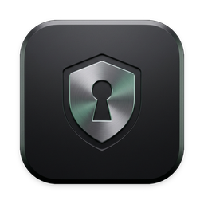

<p align="center">
  
</p>

<h1 align="center">Cloak</h1>

<p align="center">
  <strong>Local-first secrets manager and process runtime.</strong><br>
  Zero-leak process memory injection, OS keychain encryption, and dynamic HTTPS proxying for developers and AI agents.
</p>

<p align="center">
  <a href="https://github.com/ArchiesDubey/cloak/releases"></a>
  <a href="LICENSE"></a>
  <a href="https://github.com/ArchiesDubey/cloak/actions"></a>
</p>

Cloak keeps API keys and tokens out of plaintext `.env` files and shell history by storing them in your OS keyring (or an encrypted vault file) and injecting them directly into process memory on demand.

It also includes a local loopback proxy that dynamically decrypts and injects credentials for outbound AI agent requests in memory, without giving tools or scripts access to raw keys.

---

### Download Desktop App & CLI (v0.6.0)

Pre-built releases for macOS and Windows are available on [GitHub Releases](https://github.com/ArchiesDubey/cloak/releases/latest):

| Platform | Package | Architecture | Direct Download |
| :--- | :--- | :--- | :--- |
| **macOS** | Disk Image (`.dmg`) | Apple Silicon (M1/M2/M3/M4) | [**`Cloak_aarch64.dmg`**](https://github.com/ArchiesDubey/cloak/releases/latest/download/Cloak_aarch64.dmg) |
| **macOS** | Disk Image (`.dmg`) | Intel (x86_64) | [**`Cloak_x64.dmg`**](https://github.com/ArchiesDubey/cloak/releases/latest/download/Cloak_x64.dmg) |
| **Windows** | Windows Installer (`.msi`) | 64-bit (x86_64) | [**`Cloak_x64_en-US.msi`**](https://github.com/ArchiesDubey/cloak/releases/latest/download/Cloak_x64_en-US.msi) |
| **Windows** | Setup Executable (`.exe`) | 64-bit (NSIS) | [**`Cloak_x64-setup.exe`**](https://github.com/ArchiesDubey/cloak/releases/latest/download/Cloak_x64-setup.exe) |

> **In-App Auto Updates**: Cloak includes built-in auto-updates. Once installed, future updates can be checked and applied directly in the app without losing any credentials or settings.
>
> **macOS first launch note**: If prompted by Gatekeeper on unsigned community builds, run:
> ```bash
> xattr -cr /Applications/Cloak.app
> ```

Opening the desktop app automatically connects your CLI and configures rules across installed AI agents.

### Or Build CLI from Source
```bash
cargo build --release
cp target/release/cloak ~/.cargo/bin/
```

---

## Daily Workflow

### 1. Store secrets
```bash
# Save to OS Keychain (prompts securely if value is omitted)
cloak set OPENAI_API_KEY sk-proj-123456789

# Require Touch ID / Secure Enclave on macOS
cloak set --touch-id PROD_API_KEY
```

### 2. Run commands with injected secrets
Secrets are injected into the child process's memory environment (`execve`). They do not touch disk, shell history, or the parent terminal:
```bash
# Run tests, scripts, or dev servers
cloak run -- python app.py
cloak run -- npm run dev

# Restrict to specific keys (least privilege)
cloak run --keys DATABASE_URL,PORT -- npm start
```

### 3. Route AI agents through the proxy
Shield raw API keys from autonomous agents (Claude Code, Cursor, Aider, custom scripts) while letting them call upstream models:
```bash
cloak run --proxy -- claude
cloak run --proxy -- aider
```
This automatically boots the local loopback proxy, configures proxy environment variables (`HTTP_PROXY`, `HTTPS_PROXY`), and maps outbound API requests to matching keys in your vault.

### 4. Link coding agents
Register Cloak rules with all local coding agents (Claude Code, Cursor, Antigravity, Windsurf, Copilot, Codex) so they retrieve credentials via Cloak instead of asking you to edit `.env` files:
```bash
cloak setup
```

---

## How It Works

### Storage
- **macOS**: Apple Keychain Services with optional Touch ID / Secure Enclave hardware access control.
- **Linux**: Secret Service API (GNOME Keyring / KWallet via D-Bus) with PAM authentication via Polkit.
- **Windows**: Windows Credential Manager / DPAPI.
- **Headless / CI**: Standalone file vault encrypted with **Argon2id** (64MB memory, 3 iterations) and **XChaCha20-Poly1305 AEAD**:
  ```bash
  export CLOAK_MASTER_KEY="your-passphrase"
  cloak --store file set API_KEY "val"
  cloak --store file run -- ./deploy.sh
  ```

### Process Memory Isolation
- Credentials pass directly to the child process's environment block.
- Command-line arguments (`ps aux`, `/proc/<pid>/cmdline`) never contain secret values.
- Parent shell variables remain empty (`env | grep KEY` prints nothing).
- Sensitive memory buffers use `zeroize::Zeroizing<String>` to wipe RAM upon deallocation. Core dumps are disabled on Unix (`RLIMIT_CORE = 0`).

### Dynamic Domain Auto-Inference
When running with `--proxy`, Cloak intercepts outbound HTTPS requests via its local CA, inspects the target hostname in memory, and derives candidate vault keys:
- `api.pexels.com` -> searches for `PEXELS_API_KEY`, injects `Authorization: <key>`.
- `api.groq.com` -> searches for `GROQ_API_KEY`, injects `Authorization: Bearer <key>`.
- `api.elevenlabs.io` -> searches for `ELEVENLABS_API_KEY`, injects `xi-api-key: <key>`.

Unauthenticated traffic (e.g. documentation, package downloads) passes through untouched.

### Just-In-Time (JIT) Resolution
If a script or agent requests a key that is missing, Cloak pauses execution and prompts for the credential directly on `stderr` (or displays an approval sheet in the Desktop HUD), allowing the process to continue without restarting.

---

## CLI Reference

| Command | Description |
| :--- | :--- |
| `cloak set <KEY> [VAL]` | Store a secret into the vault |
| `cloak set --touch-id <KEY>` | Store a secret protected by Touch ID (macOS) |
| `cloak get <KEY>` | Print masked value (`sk-p••••••••9999`) |
| `cloak get <KEY> --reveal` | Print raw unmasked value |
| `cloak list` | List all stored secret names (values hidden) |
| `cloak delete <KEY>` | Remove a secret from the vault |
| `cloak run -- <CMD>` | Execute command with secrets injected into memory |
| `cloak run --proxy -- <CMD>` | Execute command with AI loopback & HTTPS proxy routing |
| `cloak setup` | Configure Claude Code, Cursor, Antigravity, Windsurf, Copilot, Codex |
| `cloak proxy` | Start the local AI loopback proxy daemon |
| `cloak ca install` | Install Cloak local CA to system trust store |
| `cloak gui` | Open the Desktop HUD |

---

## Desktop HUD

A lightweight desktop app (Tauri v2 + React) for managing keys visually:
- `⌘E`: Toggle between compact HUD and full window.
- `⌘K`: Search across keys and project scopes.
- `⌘N`: Add a new secret.
- **Copy**: Concealed clipboard copy with automatic 30-second memory purge.
- **Reveal**: In-place reveal guarded by Touch ID / system passcode.

To run the GUI in development mode:
```bash
cd gui
pnpm install
pnpm tauri dev
```

---

## Testing

```bash
cargo test            # Rust unit & integration tests
cd gui && pnpm test   # Frontend Vitest suite
./tests/e2e_test.sh   # 41-scenario end-to-end suite
```

---

## Security & Contributing

- Security policy, threat model, and vulnerability reporting: [SECURITY.md](SECURITY.md)
- Development setup and pull request guidelines: [CONTRIBUTING.md](CONTRIBUTING.md)
- License: [MIT](LICENSE)
